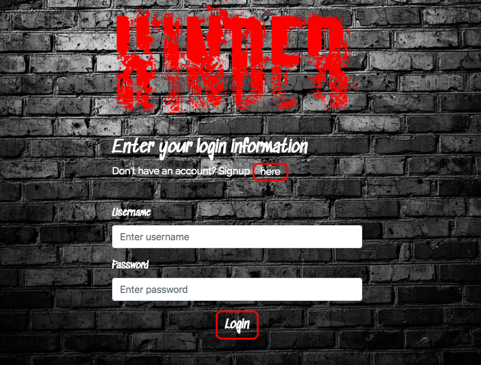
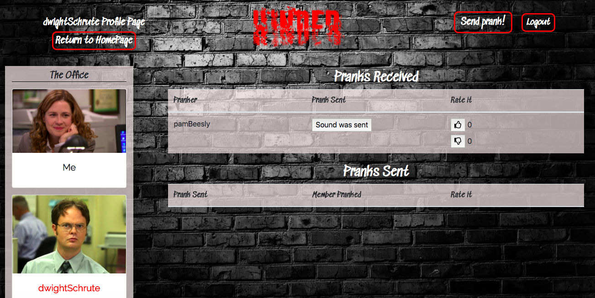

=======

### Description: 
Everyone has a group of friends they love to mess with. Hinder is a shared social network to shoot pranks at your friends, get pranked by them and rate the best goofs. When you log in you are required to sit through all your pranks before you can send any. The longer you take between logins, the more annoying it’ll be to do so. :-)

=========

### Use

The site loads to a login page. 

The page has a link to the signup page where you can join an existing group or create a new one.

Once logged in, the main page shows pending and previous pranks and allows members to vote on their favorites. 

In addition you can send a prank from here or visit your profile.

=========

### Technical Details:
This is a node.js application with a mysql backend (hosted on Heroku with JAWS) using the Sequelize ORM.

[Current Heroku Link:](https://traband-hinder.herokuapp.com)

We have a multi-page site with a login, sign up, main page and profile pages. The incoming pranks are displayed in a modal on the main page and the send pranks come from a slide in panel on the main page.

The database stores the users, login info, their group memberships and a record of the pranks. We used the Seqeulize ORM and have included a seeds file with demo data for starters.

Our GET routes populate user profiles and the main pranks page. The POST routes allow new users and groups as well as handle the creation of new pranks. The site content is a mix of static assets and handlbars templates.

We are using a graphing plugin (like Chart.js or Raphael) to visualize the information in the database to show popular pranks and highest ranked Prankers.

=========

### Local Setup
Once you clone the repository, setup a mysql database for testing and edit the config.json in the config folder.

Open the server.js file and un-comment out lines 13 and 36 to allow Sequelize to populate your local database. 

We recommend using the nodemon server to allow you to start with the lines uncommented and once the inital startup has your data populated, you can re-comment the lines out and the server will restart to make sure the data populated correctly.

=========

### Future Planning:
* Additional authentication methods for users through Google Apps, Twitter or Facebook.

* Additional prank categories
    * Giphy
    * Youtube
    * Least Favorite Songs database.

* Group Invitations

* Lastly we would like to add a notification engine that can send text alerts to users with a “current waiting pranks” count daily.

* Send a prank group-wide

* Group on Group pranking competitions

=========
